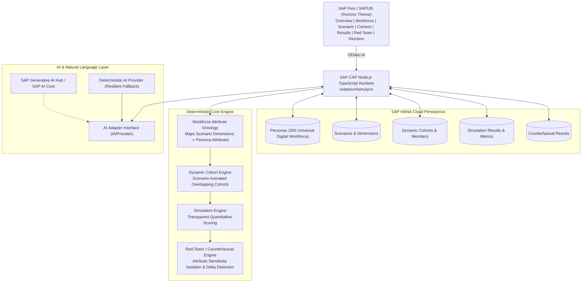

# SIMULYNX

**Inclusive Decisions. Simulated Before Implementation.**

A production-quality SAP-native decision-support simulation platform built for the SAP Hackfest. Simulynx allows organizational leaders, HR executives, and people managers to explore the quantitative and human impact of workplace policies before rolling them out across an enterprise.

> *"We don't simulate one average employee. We simulate a digital workforce with overlapping human contexts."*  
> *"We don't create new personas for every scenario. We reuse a universal digital workforce and let each scenario activate different attributes."*  
> *"We don't ask an LLM to make 300 decisions. We use AI to understand the scenario and explain results, while the simulation engine performs the actual calculations."*

---

## Architecture Overview



---

## Core Product Concepts

### 1. Universal Digital Persona Model (Scenario-Agnostic)
Personas are not generated ad-hoc for a single scenario. Instead, they represent a reusable digital workforce spanning **10 conceptual human dimensions**:
- **Identity**: Age, location, education, life stage (`early-career`, `family-with-young-children`, `mature-family`, etc.)
- **Professional**: Role, department, seniority, employment type (`full-time`, `part-time`), experience years, skills.
- **Work Style**: Remote preference, office preference, collaboration preference, autonomy preference, async preference, meeting tolerance.
- **Life Context**: Caregiving responsibility, caregiving intensity, dependents count, schedule constraints, family obligations.
- **Logistics**: City, one-way commute minutes (10–120m), transit mode (`public_transit`, `car`, `cycling`, `walking`, `mixed`), reliability.
- **Priorities**: Flexibility importance, work-life balance importance, career growth, learning, job security, autonomy.
- **Behavior**: Change tolerance, technology adoption, learning orientation, risk tolerance, technology trust.
- **Financial**: Salary band (`entry`, `mid`, `senior`, `executive`), financial sensitivity, income dependency.
- **Collaboration**: Team size, global team involvement, timezone dependency, client interaction, cross-functional dependency.
- **Accessibility**: Mobility requirements, sensory thresholds, assistive technology needs, environmental acoustic load, accessibility score.

### 2. Probabilistic Workforce Generator (No LLM Per Persona)
- Uses controlled probability distributions and realistic correlations (e.g., Suburban location $\rightarrow$ transit duration; Family with young children $\rightarrow$ 90% caregiving probability + rigid schedule constraints; SRE/Engineering $\rightarrow$ async preference).
- Scales seamlessly from 100 to 300 (default demo), 1,000, or 10,000+ personas.
- Runs in milliseconds with reproducible seed support.

### 3. Workforce Attribute Ontology
Dynamic mapping layer connecting policy parameters to persona attributes:
- **Office Attendance Policies** $\rightarrow$ `commuteMinutes`, `transportReliability`, `flexibilityImportance`, `caregivingResponsibility`, `overallAccessibilityNeed`.
- **Campus Relocations** $\rightarrow$ `commuteMinutes`, `transportationMode`, `financialSensitivity`, `relocationWillingness`.
- **AI Tooling Deployments** $\rightarrow$ `technologyAdoption`, `technologyTrust`, `learningOrientation`, `changeTolerance`, `jobSecurityImportance`.

### 4. Dynamic Cohorts (Overlapping, Non-Permanent)
Cohorts are scenario-specific lenses, **not static HR labels**:
- A single persona can simultaneously belong to *High Commute Burden*, *Caregiving Constrained*, and *High Flexibility Need*.
- Cohorts are dynamically instantiated per simulation run and persisted with match scores and contributing factors.

### 5. Deterministic Simulation Engine
- Transparent quantitative scoring without relying on non-deterministic LLM calculations.
- Evaluates individual impact, cohort risk, and organization-wide distributions.
- Scores are explicitly labeled **"Simulated Impact"** (0–100) to respect the product principle that these are decision-support models, not real-world employee surveillance.

### 6. Red-Team / Counterfactual Sensitivity Analysis
- Isolates individual sensitive attributes (e.g., Caregiving, Commute, Accessibility) by holding all other factors constant and measuring the isolated delta.
- Difference $\ge 15$ points: **"Material influence detected - Investigate"**.
- Adheres to clear, objective language: *"This attribute materially influences the simulated outcome and should be investigated."* (Never falsely labeled as "bias").

### 7. AI Result Explanation
- Evaluates **only aggregated simulation summaries** (1 LLM call per run, never 300 calls).
- Generates executive narrative, key findings, and decision-maker inquiry questions.
- Backed by an isolated adapter interface with a zero-dependency deterministic fallback for offline sandbox environments.

---

## Technology Stack

- **Application Framework**: SAP Cloud Application Programming Model (CAP) Node.js v10
- **Language**: TypeScript 7 / Node.js 24
- **Persistence**: SAP HANA Cloud (HDI Container) in production; SQLite for local dev & testing
- **API Protocol**: OData v4 (`/odata/v4/simulynx/`)
- **Frontend**: SAPUI5 v1.120 with SAP Horizon Enterprise Theme (`sap_horizon`)
- **Fiori Controls**: `sap.tnt.ToolPage`, `sap.m.IconTabBar`, `sap.m.Table`, `sap.m.Grid`, `sap.m.Dialog`
- **Deployment**: Multi-Target Application (MTA) descriptor (`mta.yaml`), `xs-security.json` (XSUAA)

---

## Local Development & Quick Start

### 1. Prerequisites
- Node.js 20+ or 24+
- npm 10+
- Git

### 2. Clone & Install
```bash
git clone <repository-url>
cd "SAP Simulynx"
npm install
```

### 3. Run Automated Tests
```bash
npm test
```
*Validates 17 test suites covering persona generation, scenario ontology parsing, dynamic cohorts, simulation scoring determinism, and counterfactual sensitivity in under 300ms.*

### 4. Running in SAP Build Code / Business Application Studio
When cloned into an SAP Build Code or SAP Business Application Studio workspace:
```bash
npm install
npm run watch
```
> **Zero Configuration Required**: Simulynx automatically initializes its local database, seeds the 300-persona digital workforce, and compiles the SAP Fiori Horizon UI. When prompted in Business Application Studio to preview port `4004`, click **Open** to launch the UI.

Alternatively, you can manually seed or re-seed benchmark scenarios at any time:
```bash
npm run seed
```

### 5. Launch the Application
```bash
npm start
```
Open your browser to:
[http://localhost:4004/simulynx/webapp/index.html](http://localhost:4004/simulynx/webapp/index.html)

---

## SAP BTP / Cloud Foundry Deployment

### 1. Production Build & MTA Packaging
```bash
npm run build
mbt build -t ./mta_archives
```

### 2. Deploy to SAP BTP Cloud Foundry Space
```bash
cf login -a https://api.cf.<region>.hana.ondemand.com
cf deploy mta_archives/simulynx_1.0.0.mtar
```

### 3. Seed Demo Data on Deployed Instance
Once deployed to BTP, trigger the seed action via curl or the Fiori ShellBar:
```bash
curl -X POST https://<your-btp-app-url>/odata/v4/simulynx/seedDemoData \
  -H "Content-Type: application/json" -d '{}'
```

---

## Live Demo Flow (2-3 Minutes for Hackfest Judges)

1. **Overview Dashboard**:
   - Point out **Digital Workforce: 300** universal synthetic personas.
   - Highlight the **Simulated Impact (28.9%)** and **Affected Workforce (21%)** for the baseline policy.
   - Point to the **Attributes Requiring Investigation**: Caregiving (+12.9 points), Accessibility (+10.0 points), Commute (+9.4 points).

2. **Digital Workforce Explorer**:
   - Switch to **Digital Workforce** tab.
   - Filter by department (e.g. *Engineering*, *Product & AI*) or search for *Maya Patel* or *Aisha Al-Mansoor*.
   - Click the inspection button on a persona to reveal all 10 human dimensions (commute transit mode, family caregiving obligations, accessibility requirements).

3. **Natural Language Scenario Simulation**:
   - Switch to **Create Scenario** tab.
   - Enter: `"Our company is moving from 2 mandatory office days to 5."`
   - Click **[Analyze Scenario]**: Observe the AI ontology extracting `officeDays: 2 -> 5` and activating `commute`, `flexibility`, `caregiving`, `accessibility`, and `workLifeBalance`.
   - Click **[Run Workforce Simulation]**: The engine scores 300 personas deterministically and switches to Results.

4. **Simulation Results & Drill-Down**:
   - Review the aggregate KPI cards (*Flexibility Index*, *Wellbeing Index*, *Retention Risk Score*).
   - Read the AI Executive Decision Intelligence summary.
   - Drill down from Organization $\rightarrow$ Cohort $\rightarrow$ Individual Persona drivers.

5. **Red Team / Counterfactual Analysis**:
   - Switch to **Red Team Analysis** tab.
   - Explain how counterfactual testing isolates attributes:
     - *Caregiving & Family Obligations*: Neutralizing this attribute drops friction by **12.9 points** (*Moderate influence detected - Investigate*).
     - *Accessibility & Sensory Requirements*: Drops friction by **10.0 points** (*Moderate influence detected - Investigate*).

6. **Decision Summary (Human Decision-Maker Executive Briefing)**:
   - Walk through the 5 briefing sections: *What Changed*, *Who is Most Affected*, *Why*, *Counterfactual Findings*, and *Questions for Review*.
   - Conclude with the core Simulynx principle:
     > *"Simulynx provides decision support. Final organizational decisions remain with human decision-makers."*

---

## Environment Variables (Optional SAP AI Core)

| Variable | Description | Default |
|---|---|---|
| `PORT` | Local HTTP port | `4004` |
| `AICORE_BASE_URL` | SAP BTP AI Core Base URL | *(Deterministic Fallback)* |
| `AICORE_CLIENT_SECRET`| SAP AI Core Client Secret | *(Deterministic Fallback)* |
| `SAP_AI_API_URL` | Alternative Generative AI Hub URL | *(Deterministic Fallback)* |

*If SAP AI Core credentials are not provided, Simulynx automatically uses its built-in deterministic provider, ensuring zero broken dependencies.*

---

## Verification & Build Artifacts

- **Automated Tests**: 14 tests across 5 test suites passing (`npm test`).
- **Production Build**: Verified with `@sap/cds-dk` production builder creating HANA table artifacts (`.hdbtable`, `.hdbview`, `.hdiconfig`).
- **Browser Automation**: End-to-end verified via subagent across all 7 Fiori views.

---

## Ethical Statement & Product Principles

1. **Synthetic Personas Only**: Simulynx uses synthetic digital personas. It never ingests, profiles, or surveillance-scores real individual employees.
2. **Directional Simulation**: Output scores are transparent simulation weights for exploring trade-offs, not empirically validated predictions of individual human behavior.
3. **Human-in-the-Loop**: The platform provides scenario intelligence to assist leadership in structuring inclusive policies, accommodations, and transit support. Final decisions always remain with human leaders.
